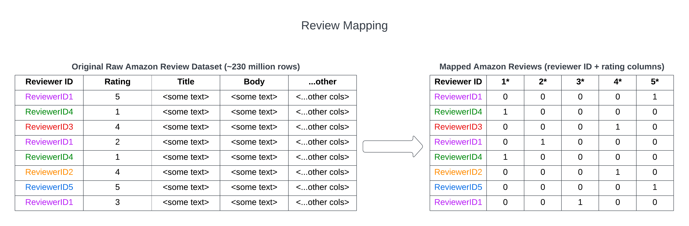
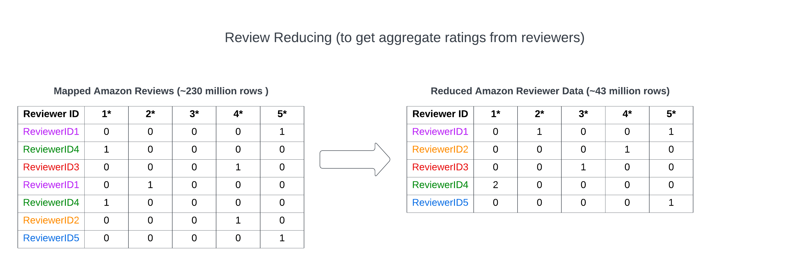
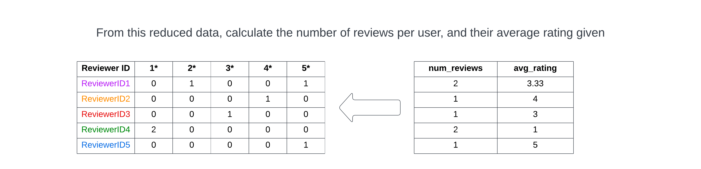
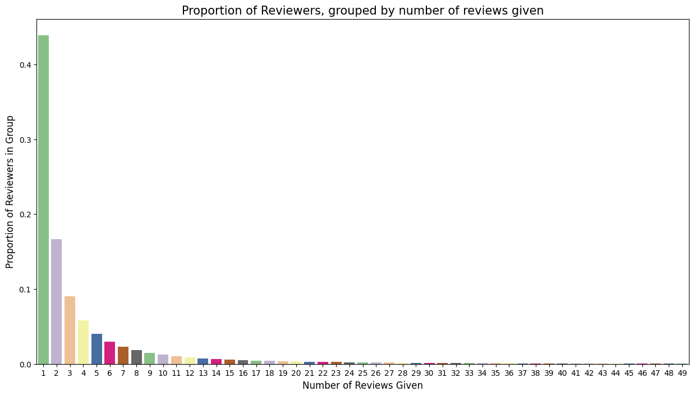
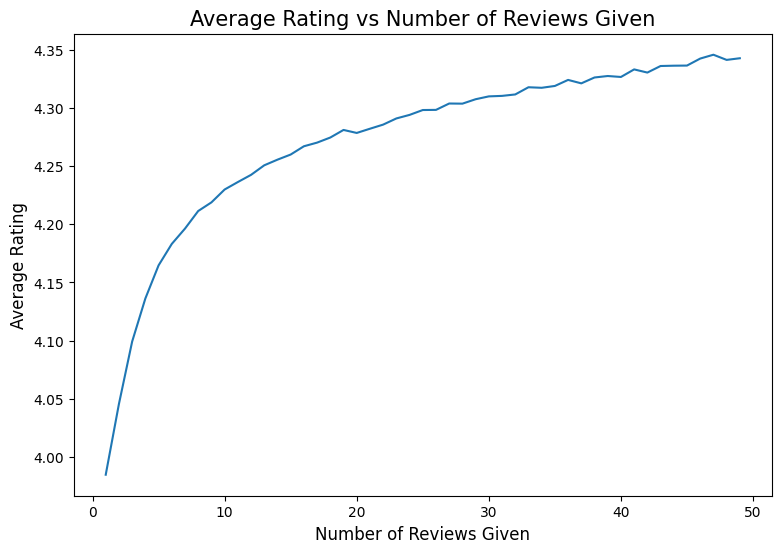
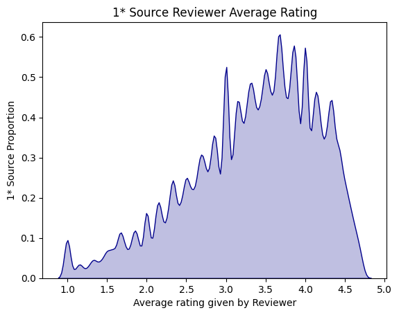

# Amazon Reviewer Behavior Analysis and Prediction

## Overview:
In this project, the objective is to analyze Amazon reviewer behavior, using a large dataset of Amazon reviews spanning from 1996 to 2018. The initial phases of this project revolved around map-reducing the Amazon reviews, in order to aggregate reviewer information. During the EDA stages, I mainly looked at how reviewer behavior changed, based on how active they were. In the later stages of this project, the main goal was to predict the average rating of a reviewer, given a 1-star review given by them.

## Motivation:
Amazon products generally have uniqitous 4 and 5* reviews, and often times it is hard to know how good a product really is. Personally, I tend to look at the 1* reviews, to get a better understanding of what issues other customers had with the product. One thing I worry about though is that some users may just give 1* reviews across the board. I believe that 1* reviews from reviewers who generally give high ratings would be more informative, not only to potential consumers, but also retailers seeking to improve their product.

## Data Source
Thanks to Jianmo Ni, from UCSD, for making this dataset public. The dataset is comprised of all Amazon reviews, given between 1996 and 2018. Individual reviews have: a reviewId, title, body, and rating given, as well as some other columns which I did not use in this project. The original dataset can be found [here](https://cseweb.ucsd.edu/~jmcauley/datasets/amazon_v2/).

# Data Pre-Processing (Map Reduce)
The biggest initial hurdle of this project was just processing the data, given it's sheer size. This was all run locally on my computer, so I had to make sure to write code that would run in a reasonable timeframe.

## [Initial Mapping](./Data_Processing/Review_Mapping.ipynb)

This initial mapping converted the numerical rating into a count column format, which would be easier to reduce in later stages.

## [Reducing by ReviewerID](./Data_Processing/Reduce_Reviewer_Data.ipynb)
In this stage, the mapped review information was reduced by reviewerID, resulting in a table with reviewerIDs, and the numbers of each ratings that they gave. Because of the high number of reviewers (~43m), only a chunk of them could be processed at a time. Multi-processing was used to further decrease the runtime, each handling a portion of this chunk. It took around 3 hours to reduce the ~230m reviews into ~43m rows of aggregated reviewer data.

## [Reviewer Stat Generation](./Data_Processing/Reviewer_Feature_Engineering.ipynb)
At this point, the ~230m reviews have been condensed into ~43m rows, each representing a reviewer, and the number of each rating they have given. It is now possible to calculate some reviewer metrics: such as the number of reviews they have given, as well as the average rating they have given. I used vectorization to speed up these calculations, as iterating through 43m rows would still take quite a while.

## Reviewer EDA
There were a couple things I was very interested in looking at within the reviewer data:
- The proportion of reviewers that gave N reviews.
- The average rating of a user, grouped by the number of reviews they have given.

##### It seems like almost half of the reviewers gave only 1 review.

This was perhaps the most interesting finding of the EDA. It seems like the average review steadily increases with the number of reviews given. It is likely that there are a lot of users who generally are disinterested in posting reviews to amazon, but encountering a product they really don't like can sway them into leaving a negative review. On the other hand, reviews that post more reviews tend to give higher ratings on average.

## Active Reviewer EDA

I'm specifically interested in where the 1* ratings are coming from, whether it is from a small proportion primarily giving low ratings, or a large proportion on average giving higher ratings -- but sometimes giving lower ratings. Because I'm looking at average ratings per reviewers, I want to focus on reviewers who gave between 5 and 15 reviews. These will be called "active reviewers". Looking at the average rating of a reviewer who has only given 1 or 2 reviews might not produce a meaningful average rating, and looking at reviewers who gave dozens of reviews might not be representation of the reviewer population.

It looks like for the most part, active reviewers who are giving 1* ratings still have reasonably high average ratings. That being said, it seems like there are a fair amount of active reviewers who have quite low average ratings.

## Modeling
Because the vast majority of reviews given on Amazon are high ratings (4* and 5*), I am most interested in looking at where the 1* reviews are coming from - specifically the average rating of the giver. I would definitely look closer at a 1* review that came from someone who gives generally positive reviews, than someone who gives generally negative reviewers.

I used a handful of NLP models to try predicting the reviewer average rating, treating this as a regression problem. In general, the models have fairly low R2 scores (peaking at ~0.045), meaning that there is a very weak signal. BERT-CNN models seemed to perform the best, and I am currently still trying to improve performance through hyperparameter tuning, and modifying the network architecture.

## Citations
Jianmo Ni requested that this paper be cited when using the Amazon reviews dataset:\
Justifying recommendations using distantly-labeled reviews and fined-grained aspects
Jianmo Ni, Jiacheng Li, Julian McAuley
Empirical Methods in Natural Language Processing (EMNLP), 2019